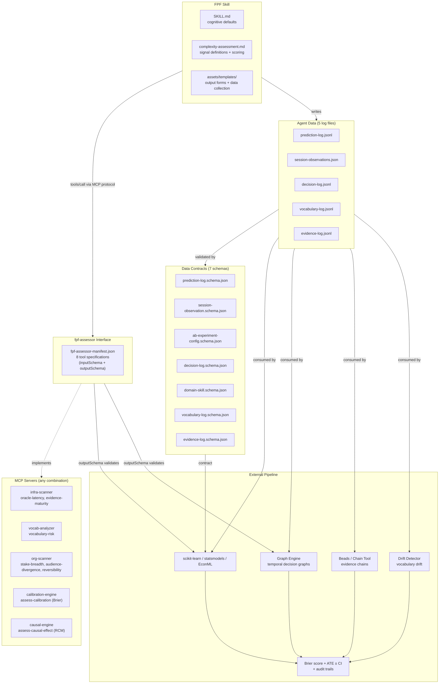

# FPF — First Principles Framework

> **AGENTS: DO NOT READ THIS FILE.** This is human-facing documentation. Load `SKILL.md` for agent instructions, `references/complexity-assessment.md` for signal interfaces, and `references/pattern-catalog.md` for pattern lookup. This file contains installation instructions, architecture overview, and contributor guidance — not executable agent content.

## Overview

Agents drift. They pick the first plausible answer, mix concerns that belong in separate worlds, and trust claims nobody verified. These aren't bugs — they're default behaviors when reasoning has no structure.

FPF installs structure. It gives the agent five mental habits: split problems into bounded contexts, keep roles separate from methods from work, hold three alternatives before choosing one, tag every claim with how much evidence backs it, and produce outputs different readers can trust from the same reasoning body.

The result: decisions you can audit, outputs that don't silently change meaning between audiences, and a reasoning trail you can inspect — not just an answer you have to trust.

Based on the [First Principles Framework](https://github.com/ailev/FPF) specification by Anatoly Levenchuk (May 2026).

## Installation

```bash
ocx add forge/fpf
```

Or install at profile level:

```bash
ocx add forge/fpf --profile <profile-name>
```

## Usage

FPF is a reasoning skill. Domain knowledge skills (customer support, developer, analyst) declare what matters in their domain. Agent roles (your custom agent) layer on top with prompts and permissions.

```jsonc
// opencode.jsonc — skills for knowledge, agents for roles
{
  "skills": ["forge/fpf", "my-domain/customer-support-domains"],
  "agent": {
    "support-agent": {
      "description": "Customer support agent using FPF reasoning",
      "prompt": "You have access to FPF reasoning and customer support domain knowledge.",
      "skills": ["forge/fpf", "my-domain/customer-support-domains"]
    }
  }
}
```

See `references/domain-composition.md` for the composition model.

## How It Works

FPF operates in four layers. Each builds on the previous — from reasoning habits the agent inhabits, through activation triggers that control engagement depth, to measurement pipelines that prove effectiveness, to role composition that extends FPF into specific domains.

### 1. Reasoning

Cognitive defaults — the patterns the agent runs continuously. These are habits of mind, not steps in a procedure.

| # | Default | What the Agent Does |
|---|---------|---------------------|
| 1 | Partition Bounded Contexts | Every term lives inside a local working frame. Identify what's being mixed before reasoning. |
| 2 | Separate Concerns | Never conflate System / Role / MethodDescription / Method / Work. Separate description from prescription from execution. |
| 3 | Hold Alternatives | Maintain ≥3 genuinely distinct options before selecting. Rate each against the same characteristic set. Trade-offs explicit. |
| 4 | Tag Evidence | Every claim gets a maturity tag: `verified` / `plausible` / `assumed` / `unknown`. Apply C.11 gate: choose now or probe more? |
| 5 | Traceable Outputs | One body of reasoning produces aligned outputs for engineering, management, research, and assurance — no silent semantic drift. |

The agent also classifies the problem's **Cynefin domain** before engaging: Clear = efficient, Complicated = analytical, Complex = exploratory, Chaotic = stabilize first. Full domain-to-strategy mapping in `references/complexity-assessment.md`.

Full defaults, heuristics, and output conventions in `SKILL.md`.

### 2. Activation

FPF engagement is gated by a 6-signal complexity score. Each signal scores 0 (low complexity) or 1 (high complexity). Sum determines depth tier.

| Signal | Measures | Score 0 | Score 1 |
|--------|----------|---------|---------|
| Oracle latency | How fast/cheap is feedback? | Fast, cheap | Slow, expensive, noisy, risky |
| Evidence maturity | Are claims verified or assumed? | Verified/testable | Assumed/untested |
| Vocabulary risk | Is language stable? | Stable across parties | Breaking down, drift live |
| Stake breadth | How many roles involved? | Single person/context | Multiple specialists, teams, agents |
| Audience divergence | Multiple audiences need aligned output? | One audience | Multiple audiences |
| Reversibility | How costly is a wrong decision? | Cheap to reverse | Irreversible or high-cost |

**Depth Tiers**

| Score | Tier | Behavior |
|-------|------|----------|
| 0 | Inactive | FPF structures not engaged. Reason directly. |
| 1 | Implicit | Defaults run silently. No formal output surfaced. |
| 2-3 | Lite | Explicit contexts, alternatives listed, informal criteria. |
| 4-5 | Standard | Full context map, decision criteria, evidence tags, comparison matrix. |
| 6 | Full | Formal DRR, UTS, evidence register, multi-audience outputs. |

**Resolution**: Signals are resolved via MCP tools where available (manifest: `assets/fpf-assessor-manifest.json`), falling back to agent heuristics when no MCP server is found. The agent surfaces its assessment and allows user override.

Full signal definitions, scoring protocol, MCP tool interfaces, Cynefin mapping, and fallback heuristics in `references/complexity-assessment.md`.

### 3. Measurement

Two pipelines measure whether FPF actually improves reasoning quality — distinct from the activation signals that determine whether FPF should engage.

**Brier Score Calibration** — measures calibration (does the agent's confidence match its correctness?)

```
Agent prediction → prediction-log.jsonl → assess-calibration (Brier) → reliability + resolution + skill score
```

Agent writes per-prediction records to `assets/templates/prediction-log.jsonl`. Oracle resolves → agent fills `actual_outcome`. External tool (scikit-learn `brier_score_loss`) computes Brier score, reliability, resolution, uncertainty, and Brier Skill Score (BSS).

**Causal Effect Estimation** — measures causal impact (does FPF improve outcomes?)

```
Session observations + experiment config → assess-causal-effect (RCM) → ATE ± CI + effect size
```

Agent writes per-session records to `assets/templates/session-observations.json`. Experiment config (`assets/schemas/ab-experiment-config.schema.json`) defines treatment/control design. External tool (EconML, statsmodels) fits Rubin Causal Model estimators and returns Average Treatment Effect with confidence intervals and balance diagnostics.

Data contracts in `assets/schemas/`. Templates in `assets/templates/`. Tool interfaces in `assets/fpf-assessor-manifest.json`.

### 4. Composition

FPF is a **reasoning engine**. Domain knowledge skills are **overlays**. Any domain skill declares its domain shapes — bounded contexts, characteristics, output forms, vocabulary — and FPF provides the reasoning fabric underneath. Domain skills declare *what* matters; FPF handles *how* to reason about it.

When a domain skill is loaded alongside FPF, the skill's domain shapes inject as partition targets, evaluation criteria, and output templates. Depth tier scales independently based on problem complexity, not role identity. See `references/domain-composition.md` for the full composition model.

## Architecture

```
fpf/
├── domain-shapes.json               # FPF's own domain shape declaration (reference example)
├── SKILL.md                          # Agent instructions: defaults, heuristics, outputs, measurability
├── assets/
│   ├── fpf-assessor-manifest.json    # MCP tools/list-compatible manifest (8 tools)
│   ├── validate-domain-shapes.mjs    # Pure function: validates a domain-shapes.json against schema
│   ├── schemas/                      # Data contracts for external tooling
│   │   ├── prediction-log.schema.json
│   │   ├── session-observation.schema.json
│   │   ├── ab-experiment-config.schema.json
│   │   ├── decision-log.schema.json
│   │   ├── domain-skill.schema.json        # Domain shape contract
│   │   ├── vocabulary-log.schema.json
│   │   └── evidence-log.schema.json
│   ├── templates/                    # Agent data collection files
│   │   ├── prediction-log.jsonl
│   │   ├── session-observations.json
│   │   ├── decision-log.jsonl
│   │   ├── vocabulary-log.jsonl
│   │   └── evidence-log.jsonl
├── references/
│   ├── glossary.md                    # Canonical definitions of all FPF-domain terms
│   ├── complexity-assessment.md       # 6-signal model, MCP interfaces, scoring protocol
│   ├── pattern-catalog.md            # Full A-G pattern reference + entry families
│   ├── domain-composition.md          # How domain knowledge overlays FPF reasoning
│   ├── drr-guidance.md               # When to produce decisions, schema ref
│   ├── uts-guidance.md               # When to stabilize vocabulary, schema ref
│   └── evidence-guidance.md          # When to register evidence, maturity ref
└── README.md                         # This file
```

## Who Consumes What

| Consumer | Reads | Purpose |
|----------|-------|---------|
| **AI Agent** (with FPF loaded) | `SKILL.md` | Cognitive defaults, activation, heuristics, output conventions |
| **AI Agent** (at complexity assessment time) | `references/complexity-assessment.md`, `references/glossary.md` | 6-signal scoring, Cynefin domain table, MCP resolution sequence, fallback heuristics. Glossary for term disambiguation across contexts. |
| **AI Agent** (pattern lookup needed) | `references/pattern-catalog.md`, `references/glossary.md` | Specific FPF pattern definitions (A.6, C.11, etc.). Glossary for pattern vocabulary. |
| **AI Agent** (producing outputs) | `references/drr-guidance.md`, `references/uts-guidance.md`, `references/evidence-guidance.md` | When to produce each output, what fields are required, anti-patterns. Writes to corresponding `assets/templates/*.jsonl` |
| **AI Agent** (data collection) | `assets/templates/prediction-log.jsonl`, `assets/templates/session-observations.json`, `assets/templates/decision-log.jsonl`, `assets/templates/vocabulary-log.jsonl`, `assets/templates/evidence-log.jsonl` | Append runtime data per schema contracts |
| **MCP Server Implementer** | `assets/fpf-assessor-manifest.json` | Tool definitions with input/output schemas — serve verbatim in `tools/list` response. May be split across multiple servers; each tool group independently deployable. |
| **MCP Server Implementer** (probes) | `references/complexity-assessment.md` §Signal Tool Probes | What each tool should check to determine score |
| **External Analytics Tool** | `assets/schemas/prediction-log.schema.json`, `assets/schemas/session-observation.schema.json` | Validate agent-generated data before computing Brier/ATE |
| **External Analytics Tool** | `assets/schemas/ab-experiment-config.schema.json` | Validate experiment design before causal estimation |
| **External Analytics Tool** | `assets/fpf-assessor-manifest.json` → outputSchema | Validate tool results against expected output shape |
| **Domain Skill Author** | `references/domain-composition.md`, `references/glossary.md` | Define domain shapes (contexts, characteristics, criteria). FPF provides reasoning underneath. Glossary for domain vocabulary mapping. |
| **FPF Pattern Author** | `references/pattern-catalog.md` → Part E (E.8, E.19) | How to write or review FPF patterns |

## How It Works (Diagrams)

### Progressive Disclosure

The skill uses layered loading to minimize context consumption. Metadata loads first (~100 tokens), body loads on activation (~1400 tokens), and detailed references load on demand.

```mermaid
flowchart LR
    subgraph L1["Level 1: ~100 tokens<br/>loaded at startup"]
        META["name: fpf<br/>description: Reasoning backbone..."]
    end

    subgraph L2["Level 2: ~1400 tokens<br/>loaded on activation"]
        SKILL["SKILL.md<br/>defaults, heuristics, outputs"]
    end

    subgraph L3["Level 3: on-demand<br/>loaded when needed"]
        GLOSSARY["glossary.md<br/>domain vocabulary"]
        COMPLEX["complexity-assessment.md<br/>signal scoring + MCP protocol"]
        PATTERNS["pattern-catalog.md<br/>A-G pattern lookup"]
        DOMAIN["domain-composition.md<br/>domain knowledge overlay"]
        GUIDANCE["*-guidance.md<br/>drr / uts / evidence<br/>produce logic"]
    end

    subgraph L4["Level 4: machine-readable<br/>MCP tools + schemas + logs"]
        DOMAIN["domain-shapes.json<br/>skill root declaration"]
        MANIFEST["fpf-assessor-manifest.json<br/>tool contracts"]
        SCHEMAS["assets/schemas/*.schema.json<br/>7 data contracts"]
        TEMPLATES["assets/templates/*<br/>5 log files: predictions,<br/>observations, decisions,<br/>vocabulary, evidence"]
    end

    L1 --> L2 --> L3 --> L4
```



### MCP Architecture

`fpf-assessor-manifest.json` is an interface contract, not a single implementation. Multiple MCP servers can implement subsets of the 8 tools independently. The agent discovers available tools via the MCP protocol and falls back to heuristics where no server provides a given tool.



## Extending

### Adding Domain Roles

Create a domain skill that declares domain shapes. See `references/domain-composition.md` for the overlay model. Domain skills should NOT replicate FPF reasoning patterns — only declare what matters in their domain.

### Implementing MCP Assessor

Implement the `fpf-assessor` MCP server with tools matching the interfaces defined in `references/complexity-assessment.md`. A single server may implement all 8 tools, or multiple servers may each implement one tool group. Common output schema ensures tool-agnostic aggregation. Prioritize HIGH-reliability signals first (oracle-latency, evidence-maturity, assess-calibration). Calibration tools (Brier) have deterministic implementations in scikit-learn; causal estimators can use statsmodels, EconML, or causalml.

## Sources

- [FPF Specification](https://github.com/ailev/FPF) — core conceptual specification by Anatoly Levenchuk (May 2026)
- [Agent Skills Specification](https://agentskills.io/specification) — skill format standard
- [Cynefin Framework](https://en.wikipedia.org/wiki/Cynefin_framework) — domain classification by Dave Snowden (1999)
- [Brier Score](https://en.wikipedia.org/wiki/Brier_score) — probabilistic forecast verification by Glenn W. Brier (1950)
- [Rubin Causal Model](https://en.wikipedia.org/wiki/Rubin_causal_model) — potential outcomes framework by Donald Rubin (1974)
- [Decision Quality](https://en.wikipedia.org/wiki/Decision_quality) — decision-analysis framework by Ronald A. Howard (1966)
- [JSON Schema](https://json-schema.org/specification.html) — data contract specification (Draft 2020-12)

## License

Proprietary. See original FPF specification for terms.
